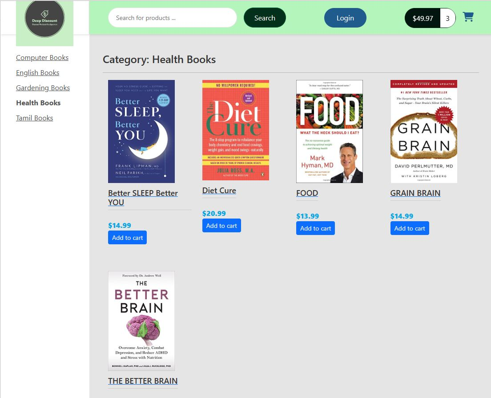

# DEEP-DISCOUNT-ONLINE-STORE

#### Sample screen shots

## Table of Contents

- [Description](#Description)

- [Installation](#Installation)

- [Instructions](#Instructions)

- [License](#License)

- [Contribute](#Contribute)

- [Tests](#Tests)

- [Questions](#Questions)

- [Improvements](#Improvements)

## Description

This is a angular front end for DeepDiscountOnlineStore. Backend is done usign Java Spring Boot. Using this app, one can browse books by category, search by partial name, add books to shopping cart, view shopping cart, checkout shoping cart, supply customer, shipping address, billng address, credit card info and complete the purchase.  The back end will process the order and generate a order confirmation.  The back end will also update all the relevant tables and maintain Order info in database. 

## Installation

clone the repository , do npm i and install angular to get going

## Instructions

It has pretty intuitive UI easy to use online shopping store front end.

## License

This project is licensed under the [ISC](https://opensource.org/licenses/ISC) License.

## Contribute

Please use my e-mail to contact me on how to contribute to this project.

## Tests

There are no automated tests written for this app.

## Questions

https://github.com/s-suresh-kumar
suresh01@yahoo.com

## Improvements

I  would like to integrate the payment processing to this app as  a next step.

Also the login functionality is broken, need to come up with a better security front end in the next iteration of the app.

This project was generated with [Angular CLI](https://github.com/angular/angular-cli) version 14.0.7.

## Development server

Run `ng serve` for a dev server. Navigate to `http://localhost:4200/`. The application will automatically reload if you change any of the source files.

## Code scaffolding

Run `ng generate component component-name` to generate a new component. You can also use `ng generate directive|pipe|service|class|guard|interface|enum|module`.

## Build

Run `ng build` to build the project. The build artifacts will be stored in the `dist/` directory.

## Running unit tests

Run `ng test` to execute the unit tests via [Karma](https://karma-runner.github.io).

## Running end-to-end tests

Run `ng e2e` to execute the end-to-end tests via a platform of your choice. To use this command, you need to first add a package that implements end-to-end testing capabilities.

## Further help

To get more help on the Angular CLI use `ng help` or go check out the [Angular CLI Overview and Command Reference](https://angular.io/cli) page.
